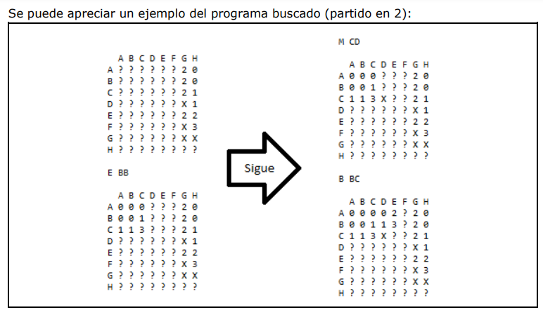

# Buscamina | Trabajo Obligatorio

# _Principios de Programación | Tecnólogo en Informática_

## Indice

-   [Introducción](#introduccion)
-   [Descripción del problema](#descripcion-del-problema)
-   [Primera parte](#primera-parte)
-   [Segunda parte](#segunda-parte)

## Introducción

Tras el gran éxito en ventas y ganancias logrado en 2016 por cierto juego recientemente
adaptado para celulares, la empresa Re Originales S.A. planea una adaptación del
conocido juego Buscaminas y ha contactado a su grupo de trabajo para ayudar en su
implementación.
Debido a que hace demasiados años que no se realiza una nueva versión del juego, se le
ha asignado a su grupo la tarea de realizar un prototipo inicial simplificado de éste, con
el cual poder luego evaluar nuevos aspectos de jugabilidad.

## Descripción del problema

Se quiere construir un programa simplificado del Buscaminas, para ser jugado sin el uso
de un mouse.
El juego consta de la exploración de un tablero en el cual existen minas escondidas.
El jugador debe explorar completamente dicho tablero marcando todas las minas
escondidas para poder ganar, y perderá la partida si en algún momento activa alguna de
las minas mencionadas.

## Primera parte

-   **_Del tablero_**:

    -   Se cuenta con un tablero de 8x8 casillas, las cuales serán identificadas por las
        letras de la **A** a la **H**, tanto horizontal como verticalmente, y entre éstas estarán
        escondidas **16 minas**.

    -   Inicialmente el tablero mostrará todas las casillas inexploradas, las cuales se
        indican con un signo de interrogación **'?'**.

    -   Cada lugar explorado debe indicar con un número (entre '0' y '8') las minas
        próximas (vecinas/adyacentes) a la casilla explorada.

    -   Las casillas marcadas por el jugador como sospechosas son indicadas con una **'X'**.

    -   Las casillas con bombas se indican con una **'B'**.

-   **Del jugador:**

    -   El jugador cuenta con 3 posibles jugadas en cada turno: **(E)xplorar, (M)arcar y (B)uscar**. Para indicar su jugada, el jugador digita su opción **E, M ó B**, seguido de un espacio y luego los identificadores de la fila y la columna, respectivamente. _**Por ejemplo: “E AD”**_.

    -   La jugada Explorar revela lo que se encontraba en una casilla previamente
        inexplorada.

    -   La jugada Marcar deja marcada como sospechosa una casilla previamente inexplorada, o remueve la marca de una casilla ya marcada.

    -   La jugada Buscar revela lo que se encontraba en todas las casillas no exploradas
        ni marcadas adyacentes a la casilla explorada en donde se realiza la búsqueda.
        Solo se puede Buscar en casillas exploradas cuyo número (entre '0' y '8') coincide con la cantidad de casillas adyacentes marcadas como sospechosas.

-   **Del juego:**

    -   Al iniciar el juego se debe dar la bienvenida al jugador, mencionando los 3 tipos de movimientos que pueden realizarse.

    -   Al inicio del juego se deben disponer aleatoriamente las minas en el tablero, con el único requisito de que no puede haber ninguna de éstas en la primera casilla explorada por el jugador.

    -   Al Explorar o Buscar, si se revela algún '0' (sin minas adyacentes), se deben también revelar todas las casillas adyacentes a donde se encuentren dichos '0'. Este proceso no se repite para los '0's que puedan revelarse tras aplicarse esta regla la primera vez.

    -   Si se revela una casilla con una mina, se revelan todas las minas, se termina el juego y se indica que se ha perdido la partida con el siguiente mensaje: **"¡¡¡¡ PERDISTE !!!! Suerte la próxima, se nota que la necesitás"**.

    -   Solo se pueden marcar hasta 16 casillas.

    -   El jugador gana cuando se hayan revelado 48 casillas, y se muestra lo siguiente: **"Pfff… fue pura suerte, la próxima no será tan fácil"**.

    -   En el caso que se intente una jugada sin efecto (o inválida), no se realiza ninguna modificación al tablero. Las jugadas sin efecto son:

        -   Explorar o Buscar en una casilla que está marcada.
        -   Marcar o Explorar una casilla ya explorada.
        -   Buscar en una casilla inexplorada.

        -   Marcar, Explorar o Buscar en casillas inexistentes.

        -   Buscar en casillas cuyo número no coincide con la cantidad de marcadas adyacentes.

        -   Buscar en casillas sin adyacentes inexploradas no marcadas.

        -   Si se utiliza un formato inadecuado de jugada, se debe también mostrar el siguiente mensaje: **"Formato de jugada erróneo"**.

    -   Tras cada jugada (válida o inválida) se debe volver a mostrar el tablero con sus respectivas modificaciones, en caso que corresponda.

    

### Se pide

Implementar un programa en C que cumpla con los requisitos planteados anteriormente.

### Restricciones

**1.** Para la entrada y salida de datos solamente se podrán utilizar las funciones scanf, printf, getchar, putchar.

**2.** No está permitido el uso de funciones de C que no se hayan visto en el curso (consultar si es necesario).

Se valorará además de la lógica correcta, la utilización de un buen estilo de
programación de acuerdo a los criterios impartidos en el curso. Se hará énfasis en
buenas prácticas de programación como:

● Indentación.

● Utilización correcta de las estructuras de control.

● Algoritmos razonablemente eficientes.

● Uso de comentarios.

● Uso de constantes.

● Uso de nombre nemotécnicos.

## Segunda parte

El presente obligatorio es continuación del primer obligatorio y será realizado en los
mismos equipos ya formados.
El propósito es implementar la gestión del juego “Buscaminas” con la gestión de los
usuarios y juegos.

## Administración de jugadores

_El programa deberá contar con el siguiente menú:_

**1. Gestionar usuario:** éste constará de las siguientes opciones (usar estructuras para guardar los datos):

-   **_a_. Alta de Jugador:** permitirá registrar los datos del jugador: CI (validar*), fecha de nacimiento (validar que sea fecha válida*), nombre, apellido, alias (el cual no se debe repetir) y si está activo o no. _\*\*_**(Obligatorio)**_\*\*_.

-   **_b_. Baja de Jugador:** permitirá marcar como inactivo al jugador, de manera que
    en el listado de jugadores no aparecerá, pero sí en los listados de partidas. Si el jugador dado de baja se registra nuevamente, simplemente se cambiará su estado de inactivo a activo. _**(Opcional)**_.

-   **_c_. Modificación de Jugador:** permitirá modificar los datos del jugador, para
    ello el jugador ingresará su alias y el programa mostrará todos los datos modificables permitiéndole guardar los datos o cancelar la operación._\*\*_**(Obligatorio)**_\*\*_.

**2. Consultas:**

-   **_a_. Listado de jugadores:** CI, nombre, apellido, alias y cantidad de partidas ganadas, ordenado por alias. (considere sólo jugadores activos) _\*\*_**(Obligatorio)**_\*\*_.

-   **_b_. Listado de todas las partidas:** fecha de la partida, alias jugador y resultado del juego (si ganó, perdió o abandonó). _**(Obligatorio)**_

-   **_c_. Listado de partidas por jugador:** se deberá solicitar el alias del jugador a consultar, salida: fecha de la partida, alias jugador, resultado de la partida. _**(Opcional)**_

-   **_d_. Listado de partidas por fecha:** se deberá solicitar la fecha a consultar, salida: fecha de la partida, alias jugador, resultado de la partida. _**(Opcional)**_

**3. Jugar:** esta opción funcionará igual que el obligatorio anterior pero el jugador, al comenzar a jugar, ingresará el alias (que se deberá controlar que exista) y dará comienzo el juego. También deberá agregar al juego una opción para _"Rendirse"_ con lo cual el jugador _perderá_ el juego pero se le guardará como **"abandono"**. Una vez terminado el juego se guardarán los datos de la partida. _\*\*_**(Obligatorio)**_\*\*_

**4. Salir:** permite salir del juego. _\*\*_**(Obligatorio)**_\*\*_

_**Nota:**_
Todos los menús deben tener la opción de volver al menú anterior (excepto el primero
que tendrá la opción de salir del juego).

-   Las validaciones deberán hacerse mediante funciones.
